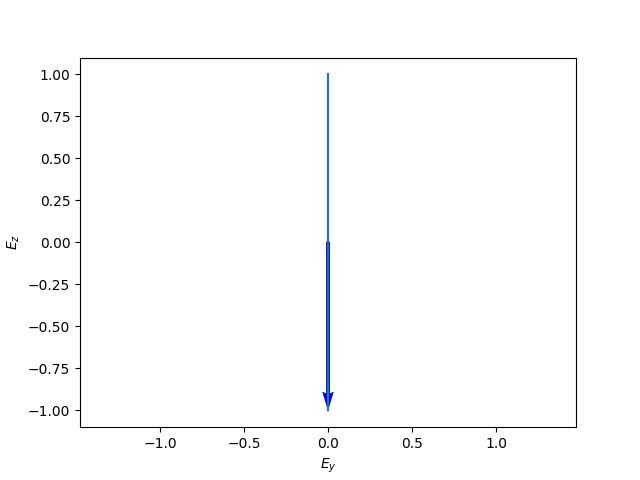

# 電磁波工学　第７回目

以下にスライド中で使用したアニメーションを示します.

## 図1
</img>

## 図3
(a) </img>

(b) </img>

## 図4
(a) </img>

(b) </img>

## 図5
(a) </img>

(b) </img>

## 図6 
(a) </img>

(b) </img>

## 図7
(a) </img>

(b) </img>

## 図8
(a) </img>

(b) </img>

## 図9
(a) </img>

(b) </img>

## 図10
(a) </img>

(b) </img>

