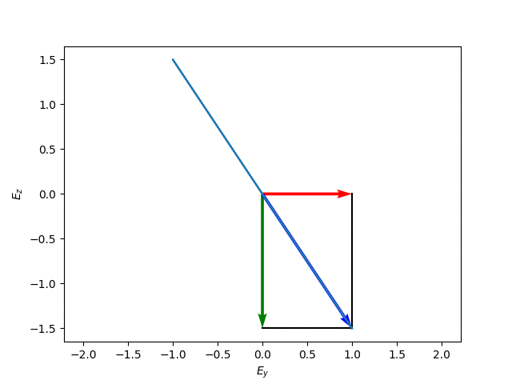

# 電磁波工学　第７回目

以下にスライド中で使用したアニメーションを示します.

## 図1
</img>

## 図3 電界ベクトルが楕円を描く様子
### (a) 3次元空間での表示
</img>

### (b) <it>yz</it>面での表示
</img>

## 図4 直線偏波（α-β=0）
</img>

</img>

## 図5 直線偏波（α-β=π）
</img>

</img>

## 図6 水平偏波
</img>

</img>

## 図7 垂直偏波
</img>

</img>

## 図8 右旋円偏波
</img>

</img>

## 図9 左旋円偏波
</img>

</img>

## 図10 左旋円偏波の回転の様子
### (a) 進行する向きに見ている
</img>

### (b) 向かってくる向きに見ている
</img>

