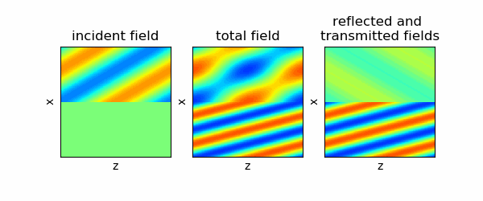

# 電磁波工学 ブルースター角
## 図1 (fig2.py, fig2.gif)
n1=1.0, n2=2.0, 入射角=63.43度，TM波を入射

</img>

## 図2 (fig3.py, fig3.gif)
n1=1.0, n2=2.0, 入射角=63.43度，TE波を入射

</img>

## 図3 (fig4.py, fig4.gif)
n1=1.0, n2=2.0, 入射角=30度，TM波を入射

</img>
